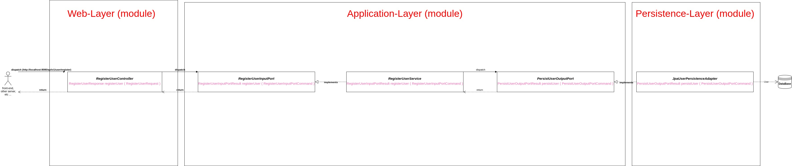

# Auth Server Documentation

[[Project On Github](https://github.com/Haidar0096/auth-server)]

This server application is a direct application of the hexagonal architecture with clean coding and dependency relations as
explained in [[Tom Homberg's book `Get Your Jands Dirty On Clean Architecture`](https://reflectoring.io/book/)]

### Modelling The App
We can imagine the app as a blackbox, represented by the `application-layer`, other layers communicate with the app-layer through input ports, and `application-layer` communicates with other (outer) layers through output adapters

So basically we have 4 main terms when it comes to the two way communication between app-layer and other layers:

- `input port`:  an interface that specifies the contract for communication of outer layers with the app layer

- `output port`: an interface that specifies the contract for communicating of app layer with outer layers

- `input adapter`: class that implements an input port, defined inside the black box (the app layer) and usually injected   by some framework inside some class in some outer layer that wants to call our app

- `output adpater`: a class that implements an output port, defined outisde the black box and usually injected by some framework inside some input adapter class that needs to call the outside world to accomplish its job

### Example Of The Control Flow
As an example of the flow of control in the app and to make things clearer, suppose the app is a black box which makes CRUD operations on a `User` model.

Web requests to read or modify or create or delete a `User` will be recieved and processed by the app, which must modify the database if needed, and return a result to the other endpoint which initially started the chain of events.

In this case:
- An input port in this case would be `RegisterUserInputPort`

- An input adapter would be `RegisterUserService` which implements `RegisterUserInputPort`

- An output port would be `PersistUserOutputPort`, which will be used by the class implementing
  the `RegisterUserInputPort` to be able to accomplish its job

- An outputAdapter would be `PersistUserOutputAdapter`

- A `RegisterUserController` would have as a field a variable of type `RegisterUserInputPort`

- A `RegisterUserService` will have as a field a `PersistUserOutputPort`

